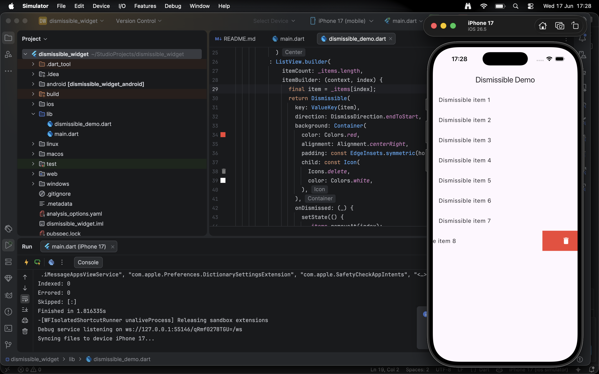

# Dismissible Widget Demo

A Flutter demo showcasing the `Dismissible` widget for swipe-to-dismiss list items with smooth animations and delete confirmations.

## Quick Start

1. **Clone the repository:**
   ```bash
   git clone https://github.com/Niyigena-Yves/dismissible-widget.git
   cd dismissible_widget
   ```

2. **Install dependencies:**
   ```bash
   flutter pub get
   ```

3. **Run the app:**
   ```bash
   flutter run
   ```

## Key Attributes

The demo demonstrates three essential `Dismissible` widget attributes:

1. **`direction`** — Controls the swipe direction (`DismissDirection.endToStart` = swipe right-to-left)
2. **`background`** — The widget displayed behind the item during dismissal (red container with delete icon)
3. **`onDismissed`** — Callback triggered when item is dismissed (removes item from list and shows snackbar)

## Screenshots


